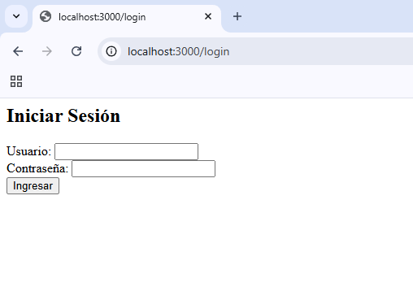
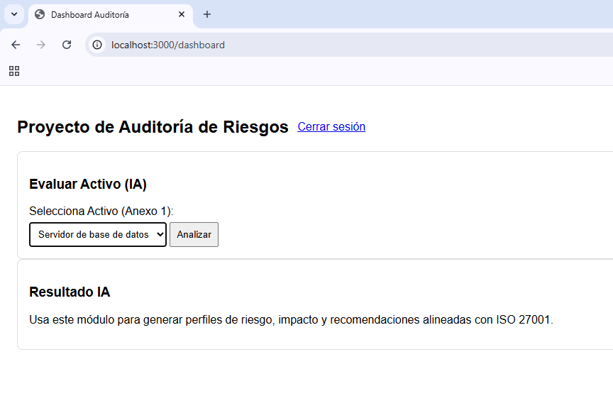
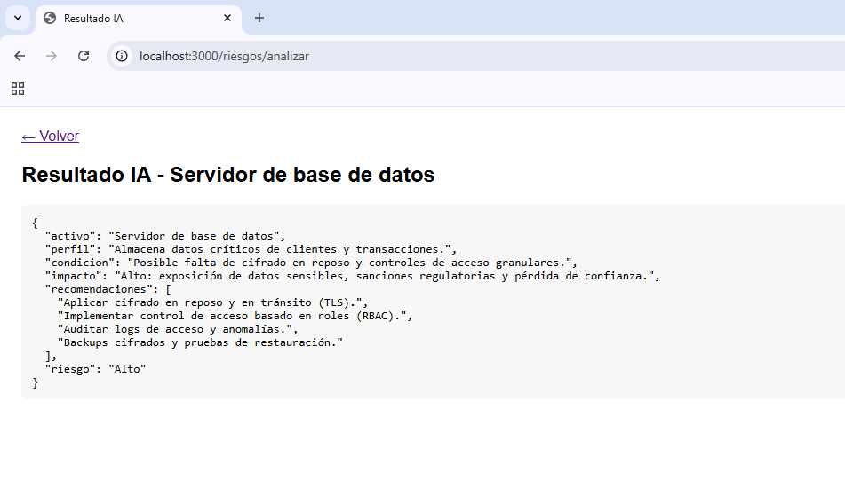
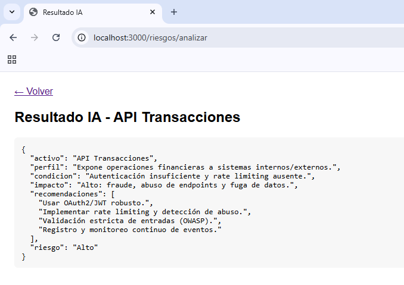
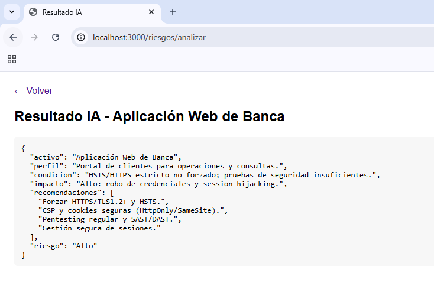
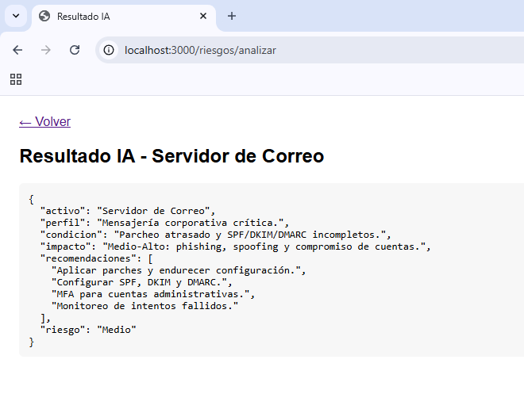
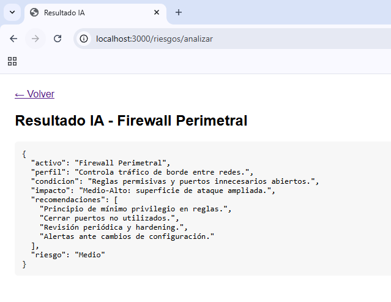

# Informe de Auditoría de Sistemas - Examen de la Unidad I

**Nombres y apellidos:**  José André La Torre Esquivel  
**Fecha:**  10/09/25
**URL GitHub:** https://github.com/LudoxAeterna/AuditoriaExamen.git

## 1. Proyecto de Auditoría de Riesgos

### Login
**Evidencia:**   
**Descripción:** Se implementó un login ficticio sin BD (usuarios en memoria) con `express-session`.  
Protección por middleware para restringir acceso a `/dashboard`.

### Motor de Inteligencia Artificial
**Evidencia:**   
**Descripción:** Motor IA local basado en plantillas por activo que genera perfil, impacto, recomendaciones 
(alineadas a ISO 27001) y nivel de riesgo. Resultado visible por POST `/riesgos/analizar`.

## 2. Hallazgos

### Activo 1: Servidor de base de datos
**Evidencia:**   
**Condición:** Posible falta de cifrado en reposo y controles granulares.  
**Recomendación:** Cifrado en reposo, RBAC, auditoría de logs, backups cifrados.  
**Riesgo:** Alto

### Activo 2: API Transacciones
**Evidencia:**   
**Condición:** Autenticación insuficiente y sin rate limiting.  
**Recomendación:** OAuth2/JWT, rate limiting, validación estricta, monitoreo.  
**Riesgo:** Alto

### Activo 3: Aplicación Web de Banca
**Evidencia:**   
**Condición:** No se fuerza HSTS/HTTPS, pruebas de seguridad insuficientes.  
**Recomendación:** HSTS/TLS1.2+, CSP, cookies seguras, pentesting.  
**Riesgo:** Alto

### Activo 4: Servidor de Correo
**Evidencia:**   
**Condición:** Parcheo atrasado, SPF/DKIM/DMARC incompletos.  
**Recomendación:** Parches, SPF/DKIM/DMARC, MFA admins, monitoreo.  
**Riesgo:** Medio

### Activo 5: Firewall Perimetral
**Evidencia:**   
**Condición:** Reglas permisivas y puertos innecesarios abiertos.  
**Recomendación:** Mínimo privilegio, cerrar puertos, hardening, alertas de cambios.  
**Riesgo:** Medio

## Anexo 1: Activos de información

1. Servidor de base de datos — Base de Datos  
2. API Transacciones — Servicio Web  
3. Aplicación Web de Banca — Aplicación  
4. Servidor de Correo — Infraestructura  
5. Firewall Perimetral — Seguridad